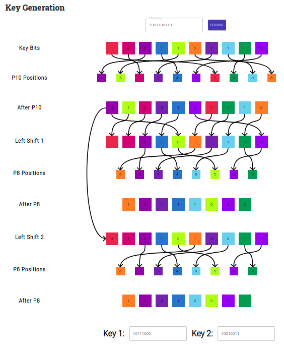
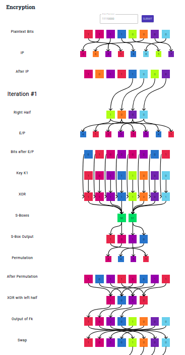
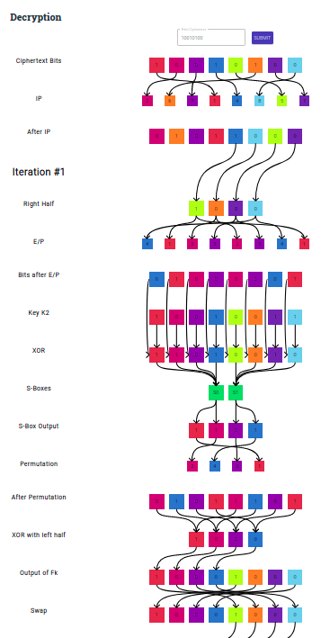
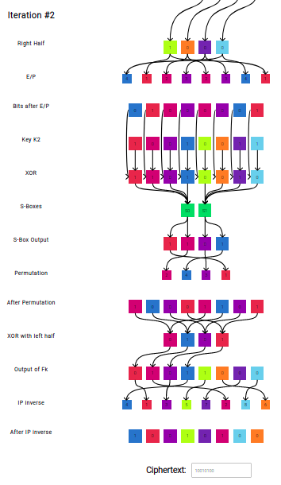

# S-DES (Simplified Data Encryption Standard)

This repository showcases the inner working of the S-DES algorithm using interesting animations and visualizations. 

Simplified Data Encryption Standard (S-DES) is similar to the DES algorithm. However, it is a smaller algorithm and has fewer parameters than DES.

- It is a **block cipher** that operates on an **8-bit input**.
- Being a symmetric key cipher, it uses the same key for both encryption and decryption. A random **10-bit key** is used to produce **two 8-bit keys** which will in turn, be used for encryption and decryption.
- It uses both, **substitution** and **diffusion**, just like DES.

Install all packages  
**`npm install`** 

Run the app  
**`npm start`**
 

| **Key Generation** |  |
:-------------------------:|:-------------------------:

| | Encryption          |  Decryption |
:-------------------------:|:-------------------------:|:-------------------------:
Iteration #1    |    |  
Iteration #2    |    |  

